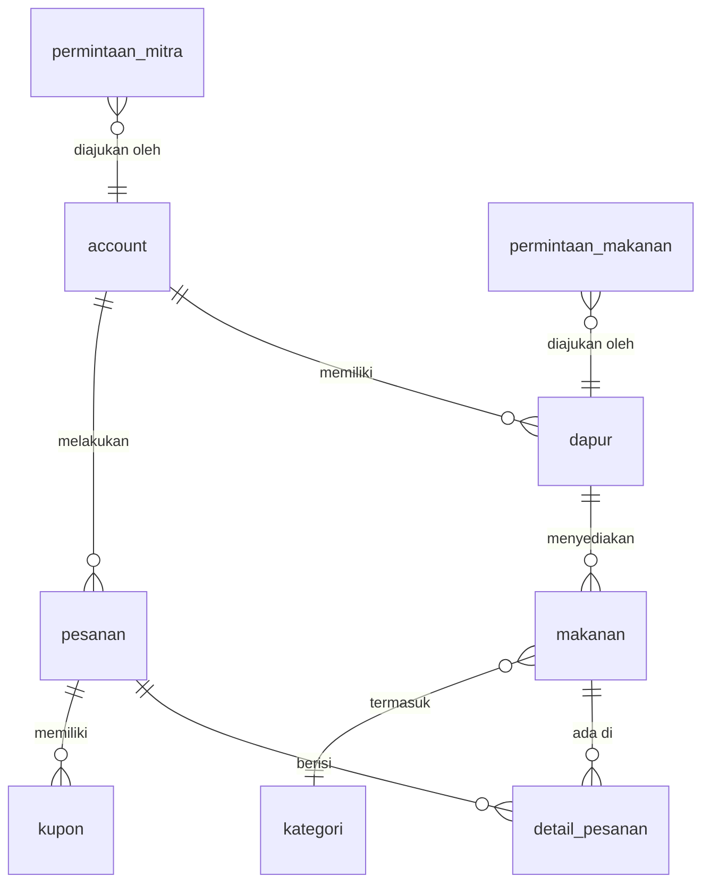

<div align="center">


<br/>


<br/>

> **Switchen** adalah platform marketplace surplus makanan F&B di Bandung yang menghubungkan restoran & kafe dengan konsumen — mengurangi *food waste* sekaligus menawarkan makanan berkualitas dengan harga yang lebih terjangkau.

<br/>

[](https://github.com/josephineandrea/switchen-mvp-paise)
[](https://github.com/josephineandrea/switchen-mvp-paise/commits)

</div>

---

## 🌿 Tentang Switchen

Setiap hari, restoran dan kafe menghasilkan surplus makanan yang masih layak konsumsi namun terbuang sia-sia. **Switchen** hadir sebagai solusi dengan mempertemukan:

- 🧑‍💼 **Mitra F&B** — mendaftarkan sisa stok layak jual dengan harga surplus
- 🛒 **Konsumen** — mendapatkan makanan berkualitas dengan harga hemat hingga 70%
- 🛡️ **Admin** — memvalidasi, menyetujui, dan memantau ekosistem

---

## 🚀 Panduan Instalasi & Menjalankan Aplikasi

Bagian ini menjelaskan cara mengatur dan menjalankan aplikasi Switchen di perangkat lokal Anda.

### Prasyarat

| Tool | Versi |
|---|---|
| Flutter SDK | ≥ 3.3.0 |
| Dart SDK | ≥ 3.3.0 (bundled) |
| Android Studio / Xcode | Latest |
| Supabase Account | — |
| Firebase Project | — |

### 1. Clone & Install

```bash
git clone https://github.com/josephineandrea/switchen-mvp-paise.git
cd switchen-mvp-paise
flutter pub get
```

### 2. Konfigurasi Environment

Buat file `.env` di root project:

```env
SUPABASE_URL=https://your-project.supabase.co
SUPABASE_ANON_KEY=your-anon-key
GOOGLE_MAPS_API_KEY=your-maps-api-key
XENDIT_PUBLIC_KEY=xnd_public_development_xxxx
```

### 3. Setup Supabase

```bash
# Install Supabase CLI
npm install -g supabase

# Login & link project
supabase login
supabase link --project-ref YOUR_PROJECT_REF

# Jalankan SQL schema di Supabase Dashboard → SQL Editor
# Gunakan file: supabase/schema.sql

# Set secrets untuk Edge Functions
supabase secrets set XENDIT_SECRET_KEY=xnd_development_xxxx
supabase secrets set QR_SECRET=switchen_qr_secret_prod

# Deploy Edge Functions
supabase functions deploy rotation-algo
supabase functions deploy generate-coupon
supabase functions deploy send-notification
supabase functions deploy xendit-webhook
```

### 4. Jalankan App

```bash
flutter run
```

> 📖 Panduan setup lengkap ada di [`SETUP_GUIDE.md`](./SETUP_GUIDE.md)

---

## 🌊 Cara Penggunaan (Alur Aplikasi)

```
┌─────────────────────────────────────────────────────────────┐
│                      CONSUMER FLOW                          │
│  Register → OTP → Home → Browse → Checkout → QR Kupon     │
└─────────────────────────────────────────────────────────────┘

┌─────────────────────────────────────────────────────────────┐
│                      PARTNER FLOW                           │
│  Register → OTP → Onboarding → [Admin Approve]             │
│  → Dashboard → Ajukan Menu → [Admin Approve]               │
│  → Edit Harga/Stok → Scan QR Pembeli                       │
└─────────────────────────────────────────────────────────────┘

┌─────────────────────────────────────────────────────────────┐
│                       ADMIN FLOW                            │
│  Login → Dashboard → Review Toko → Approve/Tolak           │
│  → Review Menu (edit harga) → Approve/Tolak                │
│  → Input Katalog Baru → Pantau Statistik                   │
└─────────────────────────────────────────────────────────────┘
```

---

## 🎭 Role & Akses (Test Accounts)

| Role | Akses | Redirect Setelah Login |
|---|---|---|
| `consumer` | Home, Store, Order, Kupon, Profil | `/home` |
| `partner` | Dashboard Mitra, Tambah Surplus, Scan QR | `/partner` |
| `admin` | Dashboard Admin, Approval, Katalog | `/admin` |

### Akun Testing (Development)

```
Consumer : 2472026@maranatha.ac.id / asdfqwer (Password)
Partner  : itvalentinohose@gmail.com / asdfqwer (Password)
Admin    : valentinohose@gmail.com    / asdfqwer (Password)
```

---

## ✨ Fitur Utama

<table>
<tr>
<td width="50%">

### 🛒 Consumer
- 🏠 **Home Feed** — Browsing makanan surplus dengan filter kategori & paginasi
- 🗺️ **Store Discovery** — Temukan toko terdekat berbasis lokasi
- 🎟️ **Sistem Kupon** — QR code untuk verifikasi pembelian
- 📦 **Riwayat Order** — Kelola semua transaksi
- 💳 **Pembayaran** — Integrasi Xendit (sandbox)
- 🔔 **Notifikasi** — Push notification via FCM

</td>
<td width="50%">

### 🏪 Mitra F&B
- 📋 **Dashboard Mitra** — Pantau produk aktif & pesanan harian
- 📝 **Onboarding** — Pendaftaran toko (review admin)
- ➕ **Ajukan Menu** — Request penambahan menu ke admin
- ✏️ **Edit Produk** — Atur harga surplus & stok harian
- 📸 **Scan QR** — Validasi kupon pembeli langsung
- 💰 **Validasi Harga** — Sistem mencegah harga melebihi harga normal

</td>
</tr>
<tr>
<td width="50%">

### 🛡️ Admin
- 📊 **Dashboard Admin** — Statistik real-time ekosistem
- ✅ **Persetujuan Toko** — Review & approve/tolak pendaftaran mitra
- 🍽️ **Persetujuan Menu** — Review harga & detail sebelum publish
- 📚 **Katalog Menu** — Input & kelola seluruh item makanan
- 🔍 **Filter Status** — Menunggu / Disetujui / Ditolak

</td>
<td width="50%">

### 🔐 Auth & Keamanan
- 📧 **OTP Email** — Verifikasi via Supabase Auth
- 👤 **Role-based Access** — Consumer / Partner / Admin
- 🔒 **Middleware Route** — Proteksi halaman berdasarkan role
- 🚀 **Auto-redirect** — Login langsung ke dashboard sesuai role

</td>
</tr>
</table>

---

## 🏗️ Arsitektur & Tech Stack

```
switchen/
├── lib/
│   ├── core/
│   │   ├── constants/          # AppColors, AppRoutes, AppStrings
│   │   ├── errors/             # Failures & Exceptions
│   │   ├── network/            # Supabase client, network info
│   │   └── utils/              # Logger, date helper, QR generator
│   │
│   └── features/               # Clean Architecture per feature
│       ├── auth/               # ✅ Login, Register, OTP, Role routing
│       ├── home/               # ✅ Feed, kategori, paginasi
│       ├── store_discovery/    # ✅ Toko terdekat, detail
│       ├── order/              # ✅ Checkout, riwayat, detail
│       ├── coupon/             # ✅ QR kupon, validasi
│       ├── notification/       # ✅ FCM push notif
│       ├── profile/            # ✅ Profil user
│       ├── partner_dashboard/  # ✅ Dashboard, onboarding, surplus, edit
│       └── admin/              # ✅ Dashboard, approval toko & menu, katalog
│
├── supabase/
│   ├── schema.sql              # Database schema lengkap
│   └── functions/              # Edge functions (Deno)
│       ├── rotation-algo/      # Algoritma rotasi toko
│       ├── generate-coupon/    # Generate & validasi QR token
│       ├── send-notification/  # FCM wrapper
│       └── xendit-webhook/     # Payment callback handler
```

### 📦 Dependencies Utama

| Kategori | Package |
|---|---|
| **State Management** | `flutter_bloc` · `bloc` · `equatable` |
| **Dependency Injection** | `get_it` · `injectable` |
| **Navigation** | `go_router` |
| **Backend** | `supabase_flutter` |
| **Functional** | `dartz` (Either pattern) |
| **Maps & Lokasi** | `google_maps_flutter` · `geolocator` · `geocoding` |
| **QR Code** | `qr_flutter` · `mobile_scanner` |
| **Payment** | `webview_flutter` (Xendit Invoice) |
| **Notifikasi** | `firebase_messaging` · `flutter_local_notifications` |
| **UI** | `google_fonts` · `shimmer` · `lottie` · `flutter_svg` |
| **Utils** | `intl` · `image_picker` · `shared_preferences` · `crypto` |
| **Monitoring** | `sentry_flutter` |

---

## 🗄️ Alur Database



### Sistem Persetujuan (Approval Flow)

```
Mitra ──► permintaan_mitra (pending)
                  │
           Admin Review
          /              \
    disetujui           ditolak
        │                  │
  🔁 Trigger DB      ✉ Catatan admin
  insert → dapur     dikirim ke mitra

Mitra ──► permintaan_makanan (pending)
                  │
           Admin Review + Edit Harga
          /              \
    disetujui           ditolak
        │
  🔁 Trigger DB
  insert → makanan
```

---

## 📸 Screenshots

> *Coming soon — run the app locally to see the full UI experience.*

---

## 🧑‍💻 Tim Pengembang

<div align="center">

Dikembangkan dalam rangka **IYREF (Indonesia Young Researcher Fair)**
Josephine Andrea Sanjaya, Valentino Hose, Andrew Therry Hendayu

</div>

---

## 📄 Lisensi

Proyek ini dikembangkan untuk keperluan akademik. Seluruh hak cipta milik tim pengembang.

---

<div align="center">


**Switchen** — *Less Waste, More Taste* 🌱

</div>
